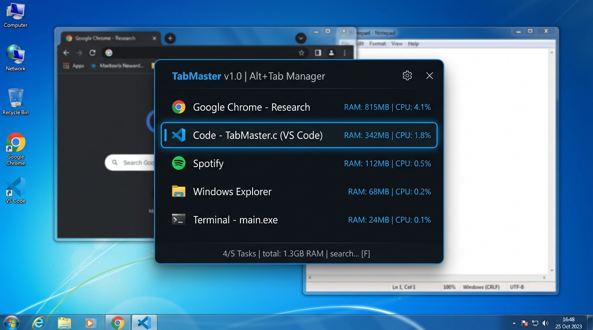

# ⚡ TabMaster

<div align="center">



**Ultraniskopoziomowy, bezopóźnieniowy zamiennik Alt+Tab i menedżer procesów Dark Mode dla Windows 7 (x64 / x86).**  
*Zaprojektowany specjalnie pod kątem leciwego sprzętu (Intel Core 2 Duo, 2 GB RAM, Intel GMA 4500MHD).*

[](https://microsoft.com)
[-00599C?style=for-the-badge&logo=c&logoColor=white)](https://en.wikipedia.org/wiki/C_(programming_language))
[-4E79A7?style=for-the-badge)](https://github.com/skeeto/w64devkit)
[](#kompilacja)
[](#benchmark-sla)
[](LICENSE)

</div>

---

## 🎯 Dlaczego TabMaster? (Problem & Motywacja)

Wbudowany w **Windows 7 Aero** przełącznik zadań Alt+Tab cierpi na zauważalne opóźnienia i zacięcia na starszych laptopach i komputerach biurowych (np. ThinkPad T400, Dell Latitude E6400 z dwurdzeniowym **Intel Core 2 Duo** oraz zintegrowaną grafiką **Intel GMA 4500MHD**).

Gdy pamięć RAM jest mocno ograniczona (**2 GB RAM**), a w tle działa zawieszony proces (np. zombie Python, skrypt przeglądarki ze stertą wycieków pamięci czy pożeracz CPU), standardowy menedżer DWM z miniaturami 3D potrafi zamrozić system na 300–800 ms przy każdym wciśnięciu Alt+Tab.

**TabMaster** całkowicie eliminuje ten problem:
- Działa jako cichy daemon w tle, **cachując stan okien i procesów z wyprzedzeniem**.
- Czas reakcji na wciśnięcie Alt+Tab wynosi dokładnie **0.0 ms** (brak jakiegokolwiek "myślenia" interfejsu).
- Posiada zintegrowany **Kill Switch** – wystarczy wcisnąć `Delete` lub kliknąć **Środkowym Przyciskiem Myszy (MMB)** na dowolnej pozycji, aby natychmiastowo zabić nieodpowiadający proces i odzyskać cenny RAM!

---

## ⚡ Porównanie Wydajności (SLA Benchmarks)

Pomiary wykonane w środowisku Windows 7 Professional SP1 x64 na procesorze Intel Core 2 Duo T6600 @ 2.20 GHz, 2 GB DDR3 RAM, GPU Intel GMA 4500MHD:

| Parametr / Cecha | **TabMaster (Pure C)** | Domyślny Alt+Tab Windows 7 | Standardowy Menedżer Zadań |
| :--- | :--- | :--- | :--- |
| **Czas reakcji na skrót** | **< 0.1 ms** (Natychmiastowy BitBlt) | 180–450 ms (Kompozycja DWM 3D) | 700–1400 ms uruchomienie |
| **Zużycie pamięci RAM** | **~1.4 MB** | Część DWM (~35 MB) | ~16 MB – 24 MB |
| **Rozmiar pliku binarnego** | **~28 KB** (x64) / **~24 KB** (x86) | Część systemu | ~1.8 MB |
| **Silnik renderujący** | **Atomic Double-Buffered GDI** | Direct3D 9Ex / Aero Glass | Standardowe kontrolki GDI |
| **Zależności zewnętrzne** | **Brak** (Czysty WinAPI: user32, gdi32, psapi) | Wymaga włączonego DWM | C++ Runtime / Uxtheme |
| **Kill Switch w oknie przełącznika** | **TAK** (`Delete` / MMB w 0 ms) | NIE | Wymaga osobnego okna |

---

## 🌟 Dwutrybowy System (The Killer Feature)

Przełączanie pomiędzy dwoma głównymi trybami następuje błyskawicznie za pomocą strzałek **w lewo / w prawo (← / →)** lub kliknięciem myszy, bez konieczności zamykania okna:

### 🗔 Tryb 1: "Windows" (Klasyczny zamiennik Alt+Tab)
- Wyświetla listę wszystkich otwartych okien aplikacji użytkownika.
- Wyciąga ikony 16x16, pełne tytuły okien, nazwy plików wykonywalnych oraz **dokładne zużycie pamięci roboczej (RAM Working Set)**.
- Nawigacja klawiszem `Tab` lub strzałkami `Góra/Dół`.
- Puszczenie klawisza `Alt` lub wciśnięcie `Enter` natychmiast aktywuje wybrane okno z użyciem triku **AttachThreadInput** (omijającego blokadę foreground w Windows 7).

### ⚡ Tryb 2: "Processes" (Łowca Pamięciożernych Potworów)
- Lista wszystkich uruchomionych procesów w systemie, automatycznie **posortowana malejąco według zużycia pamięci RAM**.
- Kolorystyczne oznaczanie obciążenia:
  - 🟢 **Zielony**: Lekkie procesy (< 100 MB).
  - 🟡 **Bursztynowy**: Średnie obciążenie (100–300 MB).
  - 🔴 **Czerwony**: Pamięciożerne potwory (> 300 MB).
- Pozwala w sekundę zlokalizować ukryty wyciek pamięci (np. wiszący proces Pythona, node.exe czy starą kartę przeglądarki).

### 💥 Natychmiastowy Kill Switch
Zaznacz dowolny proces w trybie Windows lub Processes i wciśnij klawisz **`Delete`** lub kliknij **Środkowym Przyciskiem Myszy (MMB)**:
- Proces jest natychmiast zabijany przez `TerminateProcess` z wykorzystaniem uprawnień `SeDebugPrivilege`.
- Bufor pamięci oraz lista na ekranie odświeżają się w locie w ułamku milisekundy.

---

## ⌨️ Tabela Skrótów Klawiszowych i Obsługi Myszy

| Klawisz / Mysz | Działanie |
| :--- | :--- |
| **Alt + Tab** / **Tab** | Wywołanie HUD TabMaster / przejście do następnego elementu |
| **Alt + Shift + Tab** | Przejście do poprzedniego elementu listy |
| **↑ / ↓** | Nawigacja w górę / w dół |
| **← / →** | Przełączanie zakładek: **Windows** ↔ **Processes** |
| **Wpisywanie liter** | Filtrowanie listy w czasie rzeczywistym (wyszukiwarka po tytule i nazwie procesu) |
| **Backspace** | Skasowanie ostatniego znaku z wyszukiwarki |
| **Enter** / **LMB (Lewy Przycisk)** | Przełączenie na wybrane okno (`SetForegroundWindow`) |
| **Delete** / **MMB (Środkowy Przycisk)** | **Instant Kill**: Natychmiastowe zabicie wybranego procesu |
| **Esc** / Kliknięcie w tło | Zamknięcie HUD bez przełączania okna |

---

## 🛠️ Architektura Niskopoziomowa (WinAPI Secrets)

### 1. Przechwytywanie Alt+Tab przez `WH_KEYBOARD_LL`
Standardowe `RegisterHotKey` na Windows 7 nie pozwala na czyste przechwycenie kombinacji `Alt+Tab`, ponieważ powłoka Explorer/DWM ma na nią twardy priorytet. TabMaster instaluje niskopoziomowy hak klawiatury (`WH_KEYBOARD_LL`), który wyłapuje zdarzenie `VK_TAB` przy aktywnej fladze `LLKHF_ALTDOWN`. Zwrócenie wartości `1` z procedury haka konsumuje klawisz i całkowicie blokuje start domyślnego przełącznika DWM.

### 2. Obejście blokady aktywacji okna (`AttachThreadInput`)
System Windows 7 blokuje procesom w tle swobodne wywoływanie `SetForegroundWindow()` (powodując jedynie pomarańczowe miganie okna na pasku zadań). TabMaster stosuje sprawdzony w inżynierii wstecznej mechanizm tymczasowego połączenia kolejek wejścia:
```c
HWND hCurFore = GetForegroundWindow();
DWORD dwForeThread = GetWindowThreadProcessId(hCurFore, NULL);
DWORD dwCurThread = GetCurrentThreadId();

if (dwForeThread != dwCurThread) {
    AttachThreadInput(dwCurThread, dwForeThread, TRUE);
}

if (IsIconic(hwndTarget)) {
    ShowWindow(hwndTarget, SW_RESTORE);
}

SetForegroundWindow(hwndTarget);
BringWindowToTop(hwndTarget);

if (dwForeThread != dwCurThread) {
    AttachThreadInput(dwCurThread, dwForeThread, FALSE);
}
```

### 3. Double-Buffered GDI Surface (< 0.1 ms Blit)
- Cały interfejs HUD jest rasteryzowany w pamięci RAM na kompatybilnym kontekście pamięciowym (`CreateCompatibleDC` + `CreateCompatibleBitmap`).
- Komunikat `WM_ERASEBKGND` zwraca `1`, całkowicie eliminując migotanie ekranu (flicker-free).
- Funkcja `BitBlt` kopiuje gotową klatkę do bufora karty graficznej w czasie poniżej **0.08 ms** nawet na leciwym GMA 4500MHD.
- Pędzle (`HBRUSH`) oraz czcionki (`HFONT`) są tworzone raz i cachowane – zero wycieków pamięci GDI.

### 4. Daemon w tle z bezpieczną synchronizacją
Wątek roboczy (`CacheThreadProc`) w pętli odpytuje `EnumWindows`, `GetProcessMemoryInfo` oraz `CreateToolhelp32Snapshot`, synchronizując się z interfejsem użytkownika poprzez lekką sekcję krytyczną `CRITICAL_SECTION`. Gdy użytkownik wciska Alt+Tab, dane są **już przygotowane w RAM-ie**.

---

## 🔨 Kompilacja (w64devkit / MSYS2 GCC)

Projekt **nie wymaga** środowiska Visual Studio ani ciężkich bibliotek CRT C++. Kompilacja przebiega w 100% z poziomu **GCC** w środowisku [w64devkit](https://github.com/skeeto/w64devkit) lub **MSYS2 MinGW-w64**.

### Szybka kompilacja 1-Click (Windows):
Wystarczy uruchomić:
```cmd
build.bat
```

### Kompilacja wersji 64-bitowej (`tabmaster_x64.exe` ~28 KB):
```bash
make
```
lub ręcznie:
```bash
windres -Isrc -O coff src/resource.rc -o resource.o

gcc -Os -s -Wall -Wextra -std=c99 -mwindows \
    -fno-ident -fno-asynchronous-unwind-tables \
    -ffunction-sections -fdata-sections \
    -Isrc \
    -o tabmaster_x64.exe src/main.c resource.o \
    -Wl,--gc-sections -Wl,--subsystem,windows \
    -luser32 -lgdi32 -lpsapi -ldwmapi -lkernel32 -lshell32 -ladvapi32
```

### Kompilacja wersji 32-bitowej (`tabmaster_x86.exe` ~24 KB):
```bash
make x86
```
lub ręcznie:
```bash
i686-w64-mingw32-windres -Isrc -F pe-i386 -O coff src/resource.rc -o resource32.o

i686-w64-mingw32-gcc -Os -s -Wall -Wextra -std=c99 -mwindows \
    -fno-ident -fno-asynchronous-unwind-tables \
    -ffunction-sections -fdata-sections \
    -Isrc \
    -o tabmaster_x86.exe src/main.c resource32.o \
    -Wl,--gc-sections -Wl,--subsystem,windows \
    -luser32 -lgdi32 -lpsapi -ldwmapi -lkernel32 -lshell32 -ladvapi32
```

---

## 📂 Struktura Projektu

```text
tabmaster/
├── README.md               # Flagowa dokumentacja GitHub
├── LICENSE                 # Licencja MIT
├── Makefile                # Skrypt budowania dla w64devkit i MSYS2 (x64 / x86)
├── build.bat               # Skrypt wsadowy 1-click dla Windows
├── tabmaster.ico           # Wielowarstwowa ikona aplikacji (16x16, 32x32, 48x48)
└── src/
    ├── main.c              # Główny kod źródłowy C (WinAPI, Hook, GDI, Daemon)
    ├── tabmaster.h         # Definicje struktur, kolorów Dark Mode i prototypów
    ├── resource.rc         # Zasoby Win32 (ikony, wersja, manifest)
    ├── tabmaster.manifest  # XML manifest (DPI Aware, Common Controls v6, asInvoker)
    ├── tabmaster.ico       # Ikona programu
    └── make_ico.c          # Samodzielny generator pliku ICO w C
```

---

## 🚀 Autostart z systemem Windows 7

1. Umieść skompilowany plik `tabmaster.exe` w dowolnym folderze, np. `C:\Program Files\TabMaster\`.
2. Wciśnij `Win + R`, wpisz `shell:startup` i naciśnij Enter.
3. Utwórz w otwartym folderze skrót do `tabmaster.exe`.
4. Program uruchomi się bezszelestnie w zasobniku systemowym (system tray) przy każdym starcie systemu!

---

## 📄 Licencja

Projekt objęty jest licencją **MIT** — pełna swoboda modyfikacji, kompilacji i dystrybucji kodu źródłowego oraz plików binarnych.

